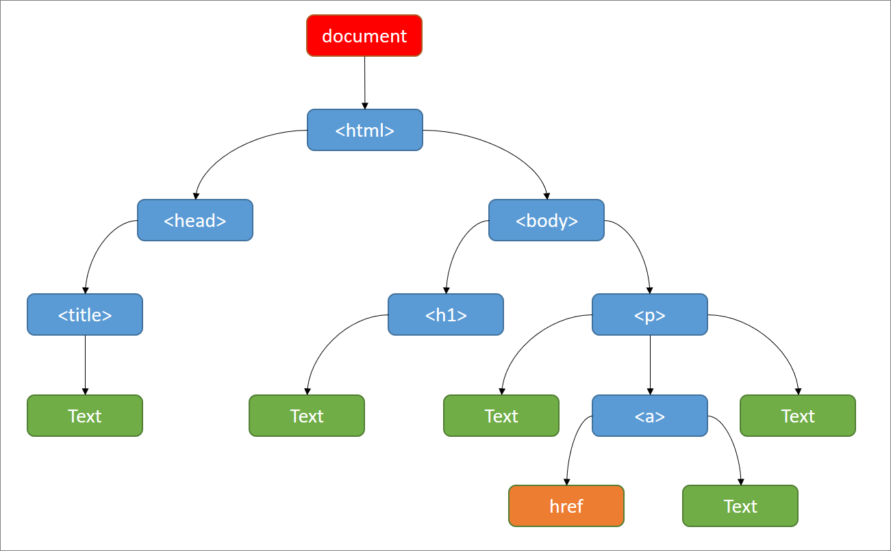
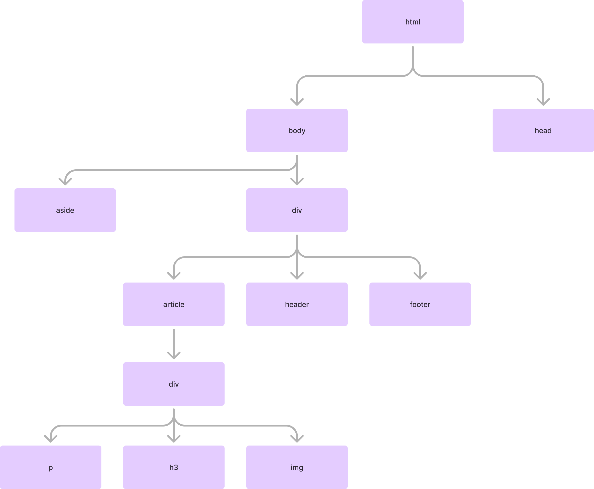

### ساختار سلسله مراتبی سندهای HTML

سندهای
HTML
به صورت سلسله مراتبی سازماندهی شده‌اند. این ساختار به برنامه‌نویسان و مرورگرها اجازه می‌دهد تا به راحتی عناصر مختلف سند را پیدا و دستکاری کنند. در این ساختار، هر عنصر
HTML
یک گره
**(Node)**
است و گره‌ها می‌توانند شامل گره‌های فرزند
**(Child Nodes)**
باشند. این روابط سلسله مراتبی به صورت یک درخت
**(Tree)**
نمایش داده می‌شود.

**انواع گره‌ها:**

-   **Root Node**:
    گره ریشه در سند HTML معمولاً تگ
    `<html>`
    است که تمام عناصر دیگر سند به عنوان فرزندان آن قرار می‌گیرند.
-   **Parent Nodes**:
    گره‌هایی که گره‌های فرزند دیگری را شامل می‌شوند. برای مثال، تگ
    `<body>`
    یک گره والد است که ممکن است شامل گره‌های فرزندی مانند تگ‌های
    `<div>`
    ,
    `<p>`
    ,
    `<a>`
    و غیره باشد.
-   **Child Nodes**: گره‌هایی که درون گره‌های والد قرار می‌گیرند. برای مثال، تگ
    `<li>`
    یک گره فرزند برای گره والد
    `<ul>`
    یا
    `<ol>`
    است.
-   **Sibling Nodes**: گره‌هایی که یک والد مشترک دارند. برای مثال، دو گره
    `<p>`
    که هر دو داخل یک
    `<div>`
    قرار دارند، گره‌های خواهر هستند.
-   **Leaf Nodes**: گره‌هایی که هیچ فرزندی ندارند، معمولاً گره‌های متنی یا گره‌های بدون محتوای داخلی مانند
    ``.

### آشنایی با DOM

**DOM**
یا
**Document Object Model**
یک **رابط ** است که اجازه دسترسی و تغییر ساختار سند‌های HTML را به کاربر می‌دهد. این رابط توسط مرورگرها و به واسطه یک زبان برنامه‌نویسی مانند جاوااسکریپت در دسترس کاربر قرار می‌گیرد.

#### ساختار DOM

DOM
شامل گره‌های مختلفی است که هر یک نوع خاصی از داده‌ها یا بخش‌های سند را نشان می‌دهند. انواع اصلی گره‌ها عبارتند از:

-   **Document Node**: ریشه درخت
    DOM
    که نمایانگر کل سند است.
-   **Element Nodes**: نمایانگر تگ‌های
    HTML
    مانند `<div>`, `<p>`, `<a>` و غیره.
-   **Text Nodes**: نمایانگر متن‌های داخل تگ‌ها.
-   **Attribute Nodes**: نمایانگر صفات تگ‌ها مانند
    `class`, `id`.
-   **Comment Nodes**: نمایانگر نظرات موجود در سند

#### کاربردهای DOM

-   **دستکاری محتوا:** DOM
    به شما امکان می‌دهد محتوای
    HTML
    را به صورت پویا تغییر دهید، مانند اضافه کردن، حذف یا ویرایش عناصر و متن.
-   **مدیریت استایل:** DOM به شما امکان می‌دهد استایل عناصر
    HTML
    را به صورت پویا تغییر دهید، مانند تغییر رنگ، اندازه و موقعیت.
-   **ایجاد رفتارهای تعاملی:**
    DOM
    به شما امکان می‌دهد رفتارهای تعاملی به صفحات وب اضافه کنید، مانند کلیک کردن، کشیدن و رها کردن و تغییر ورودی کاربر.

#### Selectors در DOM

سلکتورها ابزارهای قدرتمندی برای انتخاب و دستکاری عناصر در ساختار
DOM
هستند. آنها به برنامه‌نویسان اجازه می‌دهند تا به طور دقیق و کارآمد عناصر مورد نظر خود را در صفحات وب شناسایی و انتخاب کنند. سلکتورها می‌توانند بر اساس نام عنصر، شناسه، کلاس، ویژگی‌ها و روابط بین عناصر عمل کنند.

فرض کنید ما یک صفحه HTML با ساختار زیر داریم:

```html
<div id="container">
    <h1 class="title">Welcome to My Website</h1>
    <p class="content">This is some content.</p>
    <ul>
        <li>Item 1</li>
        <li class="special">Item 2</li>
        <li>Item 3</li>
    </ul>
    <button id="submitBtn">Submit</button>
</div>
```

حالا، بیایید چند نمونه از سلکتورها را با استفاده از JavaScript ببینیم:

1. انتخاب با ID:

```javascript
let submitButton = document.getElementById('submitBtn');
// یا
let submitButton = document.querySelector('#submitBtn');
```

2. انتخاب با کلاس:

```javascript
let contentParagraph = document.querySelector('.content');
```

3. انتخاب همه عناصر با یک کلاس خاص:

```javascript
let allSpecialItems = document.querySelectorAll('.special');
```

4. انتخاب بر اساس نوع عنصر:

```javascript
let allListItems = document.querySelectorAll('li');
```

5. انتخاب با ترکیب سلکتورها:

```javascript
let specialItemInContainer = document.querySelector('#container .special');
```

6. انتخاب بر اساس ویژگی:

```javascript
let submitButton = document.querySelector('button[id="submitBtn"]');
```

#### Attributes در DOM

Element attributes
در DOM، اطلاعات اضافی هستند که به عناصر
HTML
اضافه می‌شوند تا خصوصیات و رفتار آنها را تعریف کنند. این ویژگی‌ها می‌توانند شامل مواردی مانند
id، class، style، src
و غیره باشند. در
DOM
، هر عنصر دارای یک مجموعه از ویژگی‌هاست که می‌توان به آنها دسترسی پیدا کرد، آنها را تغییر داد یا ویژگی‌های جدیدی اضافه کرد.

فرض کنید ما یک عنصر
HTML
به شکل زیر داریم:

```html

```

حالا، بیایید با استفاده از
JavaScript،
چند عملیات مختلف روی ویژگی‌های این عنصر انجام دهیم:

```javascript
let img = document.getElementById('myImage');

let imgSrc = img.getAttribute('src');
console.log(imgSrc);

img.setAttribute('src', 'new-image.jpg');

img.setAttribute('title', 'This is a new title');

if (img.hasAttribute('alt')) {
    console.log('This image has an alt text');
}

img.removeAttribute('class');

console.log(img.src);
console.log(img.alt);

img.className = 'new-class another-class';

img.dataset.customInfo = 'Some custom data';
console.log(img.dataset.customInfo);

for (let attr of img.attributes) {
    console.log(`${attr.name}: ${attr.value}`);
}
```

این مثال نشان می‌دهد که چگونه می‌توان به روش‌های مختلف با
Attributes
عناصر در
DOM
کار کرد.

### Manipulation در DOM

DOM Manipulation
یا دستکاری
DOM
، یکی از مهم‌ترین جنبه‌های برنامه‌نویسی وب پویا است که به توسعه‌دهندگان اجازه می‌دهد ساختار، محتوا و سبک صفحات وب را به صورت پویا و در زمان اجرا تغییر دهند. این فرآیند شامل انتخاب عناصر
HTML
، تغییر محتوا و ویژگی‌های آنها، اضافه یا حذف عناصر، و تغییر استایل‌های CSS می‌شود. با استفاده از
JavaScript،
برنامه‌نویسان می‌توانند به راحتی به عناصر
DOM
دسترسی پیدا کرده و آنها را دستکاری کنند، که این امر امکان ایجاد رابط‌های کاربری تعاملی و پاسخگو را فراهم می‌کند.

#### Element Manipulation در DOM

فرض کنید یک عنصر
div
با شناسه
"container"
در
HTML
داریم

```javascript
let container = document.getElementById('container');

let newParagraph = document.createElement('p');
newParagraph.textContent = 'این یک پاراگراف جدید است.';

container.appendChild(newParagraph);

let newButton = document.createElement('button');
newButton.textContent = 'کلیک کنید';
container.appendChild(newButton);

container.removeChild(newParagraph);

let replacementDiv = document.createElement('div');
replacementDiv.textContent = 'این جایگزین دکمه شد';
container.replaceChild(replacementDiv, newButton);

let clonedDiv = replacementDiv.cloneNode(true);
container.appendChild(clonedDiv);

clonedDiv.innerHTML = '<strong>این محتوا تغییر کرده است</strong>';

let anotherParagraph = document.createElement('p');
anotherParagraph.textContent = 'این پاراگراف قبل از div اضافه شد';
container.insertBefore(anotherParagraph, replacementDiv);

anotherParagraph.setAttribute('class', 'highlight');

replacementDiv.addEventListener('click', function () {
    alert('روی div کلیک شد!');
});
```

این مثال‌ها نشان می‌دهند که چگونه می‌توان با استفاده از JavaScript، عناصر DOM را به روش‌های مختلف دستکاری کرد و تغییر داد.

#### Style Manipulation در DOM

فرض کنید ما یک عنصر HTML به شکل زیر داریم:

```html
<div id="myDiv" class="box">Hello, World!</div>
```

حالا، بیایید با استفاده از JavaScript، استایل این عنصر را تغییر دهیم:

###### تغییر استایل با استفاده از خاصیت `style`

```javascript
let myDiv = document.getElementById('myDiv');

myDiv.style.backgroundColor = 'lightblue';

myDiv.style.color = 'white';

myDiv.style.fontSize = '20px';

myDiv.style.margin = '10px';
```

##### استفاده از `classList` برای مدیریت کلاس‌ها

```javascript
myDiv.classList.add('highlight');

myDiv.classList.remove('box');

if (myDiv.classList.contains('highlight')) {
    console.log('The highlight class is applied');
}

myDiv.classList.toggle('active');
```

##### استفاده از `cssText` برای تنظیم چندین استایل به صورت یکجا

```javascript
myDiv.style.cssText = `
    background-color: lightgreen;
    color: black;
    font-size: 18px;
    padding: 15px;
    border: 2px solid black;
`;
```

##### اضافه کردن استایل‌های پویا با استفاده از `setAttribute`

```javascript
myDiv.setAttribute('style', 'background-color: pink; color: blue; font-weight: bold;');
```

ما می‌توانیم این کلاس‌ها را به عناصر HTML اضافه کنیم یا حذف کنیم تا استایل‌های آنها را تغییر دهیم.

-   [DOM](https://developer.mozilla.org/en-US/docs/Web/API/Document_Object_Model)
-   [HTML attributes](https://javascript.info/dom-attributes-and-properties#html-attributes)
-   [Manipulating documents](https://developer.mozilla.org/en-US/docs/Learn/JavaScript/Client-side_web_APIs/Manipulating_documents)

### پروژه



#### هدف

در این پروژه، ;کارآموزان باید با استفاده از
HTML
، یک ساختار
DOM
را که در یک تصویر نشان داده شده است، پیاده‌سازی کنند.

#### مراحل

1. با توجه به تصویر نشان‌ داده شده سند
   HTML
   مورد نظر را ایجاد کنید
2. در یک گزارش توضیح دهید چرا استفاده از این ساختار سلسله مراتبی بهتر از استفاده از یک تگ خاص مانند
   Div
   برای همه المان ها است
3. با استفاده از فایل
   Json
   ای که در اختیارتون قرار داده شده است آیتم های قسمت
   Article
   را بسازید

#### نکات

-   ساختار سلسله‌مراتبی و گزارش خود را برای منتور خود ارسال کنید
